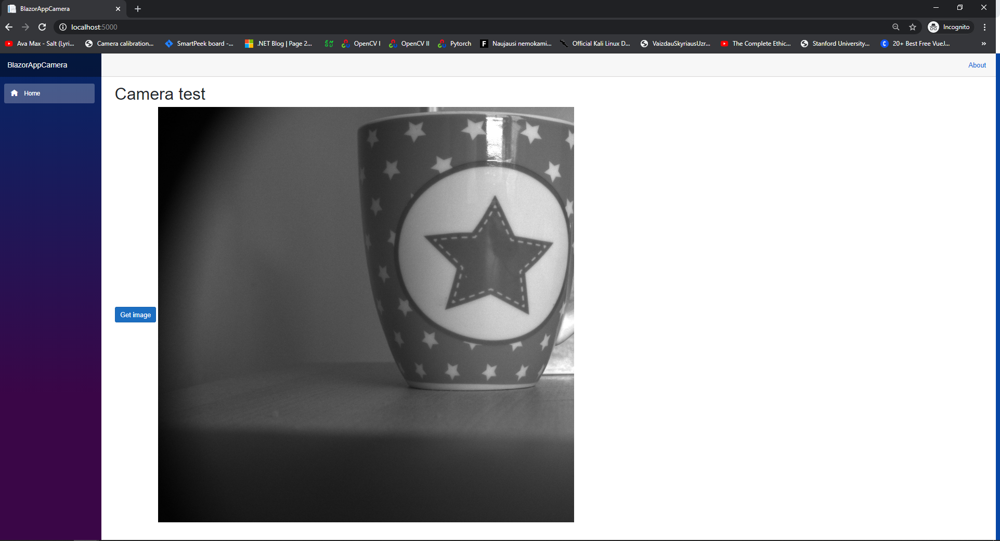

# Basler area scan camera wrapper  

> Use this C++/CLI wrapper with [Basler cameras](https://www.baslerweb.com/en/products/) for .NET Core projects


---

## Table of Contents

- [Usage](#usage)
- [Blazor](#blazor)
- [License](#license)

---

## Usage
Import CoreCamera class:
```C#
using CoreCamera;
```
Initialize camera object and set camera parameters:
```C#
private ICameraCore _camera;

public void Initialize()
{
    AppDomain.CurrentDomain.ProcessExit += new EventHandler(CurrentDomain_ProcessExit);
    _camera = new CameraCore("Front1", ImageArrived);
    _camera.SetExposure(10000);
    _camera.SetHeight(1000);
    _camera.SetWidth(1000);
    _camera.SetGain(200);

    _camera.UpdateSettings();
    _camera.Grab();
}
```
Create action for image arrived event:
```C#
public void ImageArrived(byte[] bytes, int height, int width)
{
    Mat img = new Mat(height, width, DepthType.Cv8U, 1);
    img.SetTo(bytes);
    Console.WriteLine("Saving test image");
    CvInvoke.Imwrite("test.jpg", img);
    _camera.StopGrab();
}        
```
## Blazor
You can use this library with [Blazor](https://docs.microsoft.com/en-us/aspnet/core/blazor/get-started?view=aspnetcore-3.1&tabs=visual-studio)

Add this code to your page:

```C#
@page "/"
@using System.IO
@using BlazorAppCamera.Data

@inject CameraService CameraService

<h1>Camera test</h1>
<button class="btn btn-primary" @onclick="GetFrame">Get image</button>


@code
{

    private string _imageString = null;
    public void GetFrame()
    {
        CameraService.StartGrab(ImageArrived);
    }

    void ImageArrived(byte[] bytes)
    {
        _imageString = $"data:image/png;base64,{Convert.ToBase64String(bytes)}";
    }
}
```
Create Camera Service:

```C#
using System;
using CoreCamera;

namespace BlazorAppCamera.Data
{
    public class CameraService

    {
        private readonly ICameraCore _camera;
        private Action<byte[]> _action;

        public CameraService()
        {
            _camera = new CameraCore("Front1", ImageArrived);
        }

        public void ImageArrived(byte[] bytes, int height, int width)
        {
            _action.Invoke(bytes);
        }

        public void StartGrab(Action<byte[]> action)
        {
            _action = action;
            _camera.SetExposure(50000);
            _camera.SetHeight(1000);
            _camera.SetWidth(1000);
            _camera.UpdateSettings();
            _camera.Grab();
        }
    }
}
```




## License

[](http://badges.mit-license.org)

- **[MIT license](http://opensource.org/licenses/mit-license.php)**


